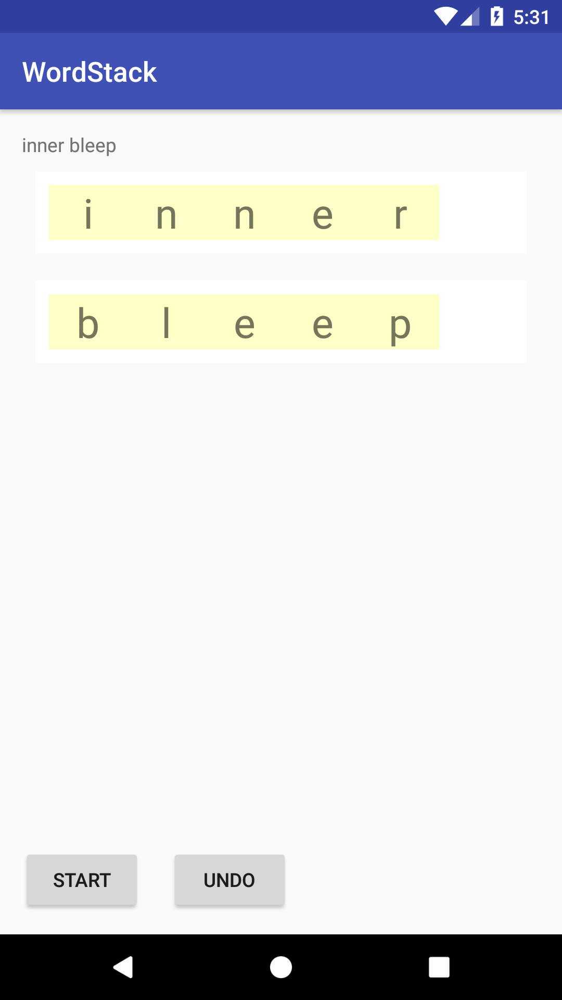
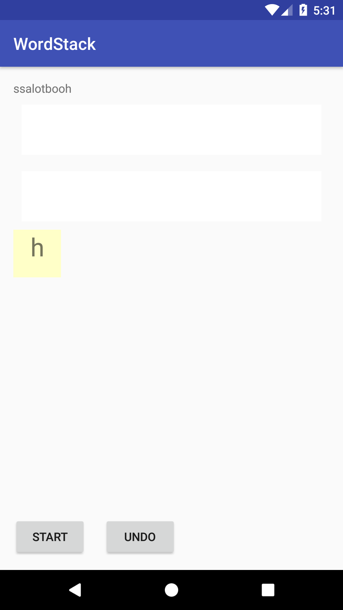
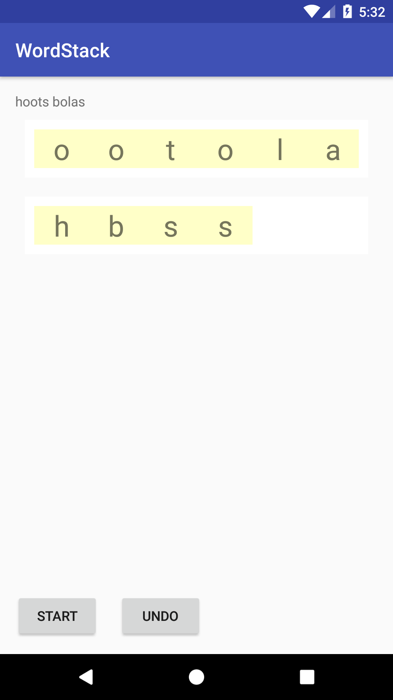

# Word Stacks 📚

An engaging Android puzzle game where players unscramble letter tiles to form two hidden words using drag-and-drop mechanics and stack algorithms.

## What It Does

Word Stacks presents players with a stack of scrambled letter tiles that contain two 5-letter words mixed together. Players must drag tiles from the central stack to two separate word areas to reconstruct the original words. The game features:

- **Stack-based tile management** - Letters are stored in a custom `StackedLayout` that implements LIFO (Last In, First Out) behavior
- **Drag-and-drop interface** - Intuitive touch controls with visual feedback during tile movement  
- **Word scrambling algorithm** - Randomly interleaves two words character by character, then reverses the result
- **Undo functionality** - Players can reverse their last move if they make a mistake
- **Dictionary integration** - Loads 5-letter words from a text file asset

## Game Mechanics

1. **Start Game**: Two random 5-letter words are selected and scrambled together
2. **Tile Interaction**: Players drag tiles from the central stack to word slots
3. **Stack Behavior**: Only the top tile is visible and draggable at any time
4. **Win Condition**: Game completes when all tiles are placed and both words are revealed
5. **Undo System**: Players can return the most recently placed tile to the stack

## 🛠 Tech Stack

| Component | Technology |
|-----------|------------|
| 📱 Platform | Android (API 23+) |
| 💻 Language | Java |
| 🎨 UI Framework | AndroidX + Material Design |
| 🏗 Build System | Gradle |
| 📊 Data Structure | Custom Stack Implementation |
| 🎮 Interaction | Drag & Drop API |

## Installation & Setup

### Prerequisites
- Android Studio Arctic Fox or newer
- Android SDK API 23 or higher
- Java 8+

### Build Instructions

1. **Clone the repository**
   ```bash
   git clone https://github.com/stabgan/Word-Stacks.git
   cd Word-Stacks
   ```

2. **Open in Android Studio**
   - Launch Android Studio
   - Select "Open an existing project"
   - Navigate to the cloned directory

3. **Build and run**
   ```bash
   ./gradlew assembleDebug
   ./gradlew installDebug
   ```

   Or use Android Studio's run button to build and deploy to a connected device/emulator.

## Architecture

### Core Components

- **`MainActivity`** - Main game controller handling UI events and game state
- **`LetterTile`** - Custom TextView representing individual letter tiles with drag behavior
- **`StackedLayout`** - Custom ViewGroup implementing stack data structure for tile management
- **Word Dictionary** - Text file containing 5-letter words loaded at runtime

### Key Algorithms

- **Word Scrambling**: Randomly interleaves characters from two words, then reverses the string
- **Stack Management**: Custom implementation ensuring only the top tile is visible/interactive
- **Drag Handling**: Android's drag-and-drop API with visual feedback states

## Screenshots

  

## Recent Updates

- ✅ Migrated from deprecated Android Support Library to AndroidX
- ✅ Updated to modern Android SDK (API 34)
- ✅ Replaced JCenter with Maven Central repository
- ✅ Updated dependencies to latest stable versions
- ✅ Enhanced build configuration for modern Android development

## License

Licensed under the Apache License, Version 2.0. See [LICENSE](LICENSE) for details.

---

*Originally developed as part of Google's Applied Digital Skills curriculum for Android development education.*